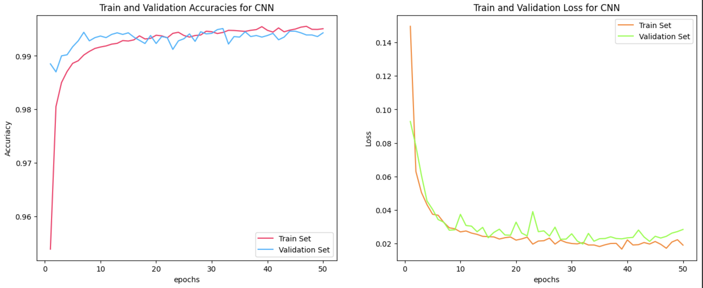

# MNIST Digit Classification with Neural Networks 🧠🔢

A project exploring different neural network architectures for classifying handwritten digits from the MNIST dataset.

## 📋 Overview
This project compares **Multi-Layer Perceptrons (MLP)** and **Convolutional Neural Networks (CNN)** for digit classification. We experiment with model architectures, hyperparameter tuning, and evaluate performance through accuracy/loss metrics.

## 🛠️ Features
- **Data Preprocessing** ⚙️:
  - Normalize pixel values to `[0, 1]`.
  - Reshape images from `(28, 28)` to `(784,)` for MLP.
  - One-hot encode labels using TensorFlow.

- **Model Architectures** 🧩:
  ### 1. MLP (Multi-Layer Perceptron)
  | Layer        | Output Shape | Parameters | Activation |
  |--------------|--------------|------------|------------|
  | Input        | (784,)       | 0          | -          |
  | Dense (128)  | (128,)       | 100,480    | ReLU       |
  | Dense (128)  | (128,)       | 16,512     | ReLU       |
  | Output (10)  | (10,)        | 1,290      | Softmax    |

  ### 2. CNN (Convolutional Neural Network)
  | Layer Type          | Filters/Units | Parameters | Activation |
  |---------------------|---------------|------------|------------|
  | Input (28x28x1)     | -             | 0          | -          |
  | Conv2D + Dropout    | 64 filters    | 1,664      | ReLU       |
  | MaxPooling2D        | -             | 0          | -          |
  | Flatten             | -             | 0          | -          |
  | Dense Layers (128)  | 2 layers      | 204,928    | ReLU       |
  | Output (10)         | -             | 1,290      | Softmax    |

## 🚀 Model Improvements
To boost CNN performance, we:
- ✅ Added **3 convolutional layers** (up from 2)
- ✅ Increased filters to **128 per layer**
- ✅ Used **smaller kernels (3x3)** with `padding="same"`
- ✅ Enhanced feature extraction capabilities

### **Enhanced CNN Architecture**
| Layer Type          | Details                          | Parameters | Activation |
|---------------------|----------------------------------|------------|------------|
| Input               | 28x28x1                          | 0          | -          |
| Conv2D x3           | 128 filters, 3x3 kernel          | 296,448    | ReLU       |
| Dropout (40%)       | After each Conv2D                | 0          | -          |
| MaxPool             | 2x2 pooling                      | 0          | -          |
| Flatten             | Converts to 1D vector            | 0          | -          |
| Dense x2            | 128 units each                   | 819,968    | ReLU       |
| Output              | 10 units                         | 1,290      | Softmax    |

## 📊 Results
### Resulting graphs of the final CNN model:

